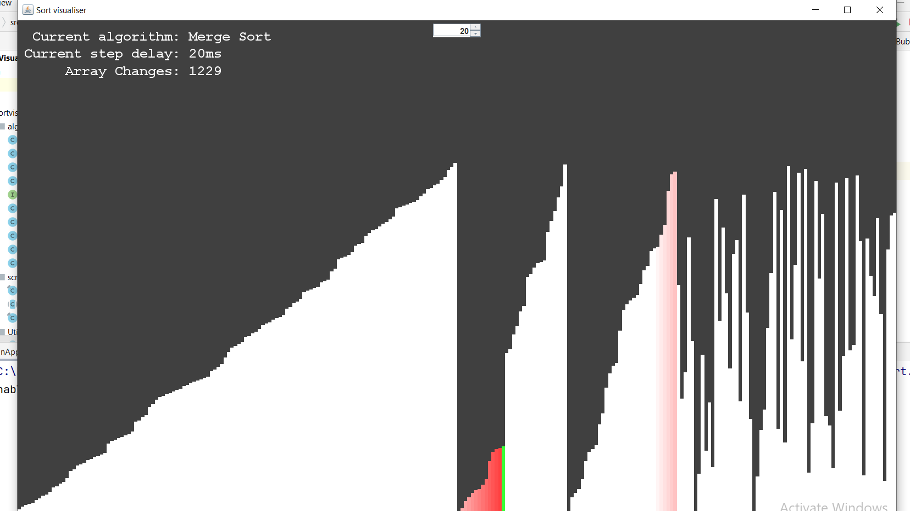

# SortingVisualizer
Sort algorithm visualization

SORTING ALGORITHMS VISUALIZATION

The project implements most common and popular sorting algorithms to see their flow as a GUI .

Currently Nine Sorting Algorithms are implemented -->
* Bubble Sort
* Selection Sort
* Insertion Sort
* Merge Sort
* Iterative Merge Sort
* Quick Sort
* Counting Sort
* Radix Sort
* Heap Sort

## Here is a screenshot of merge sort visualization 

